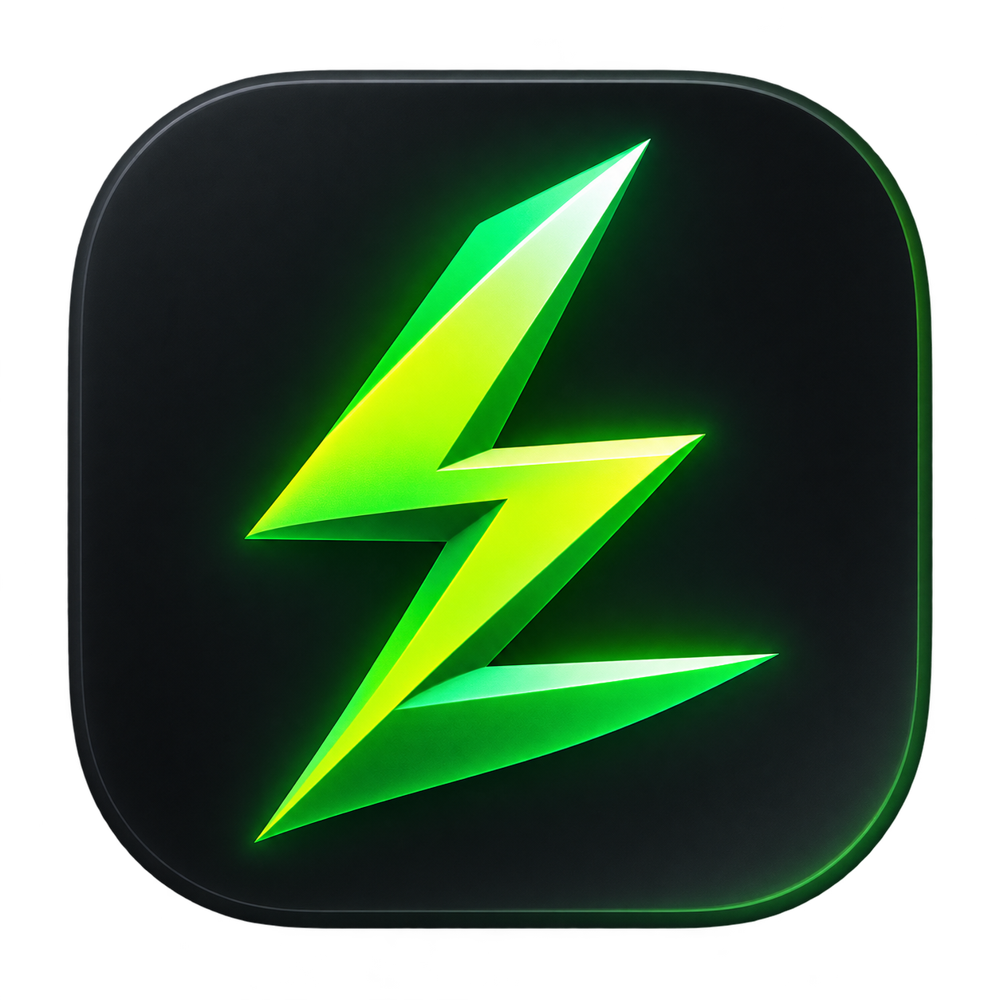
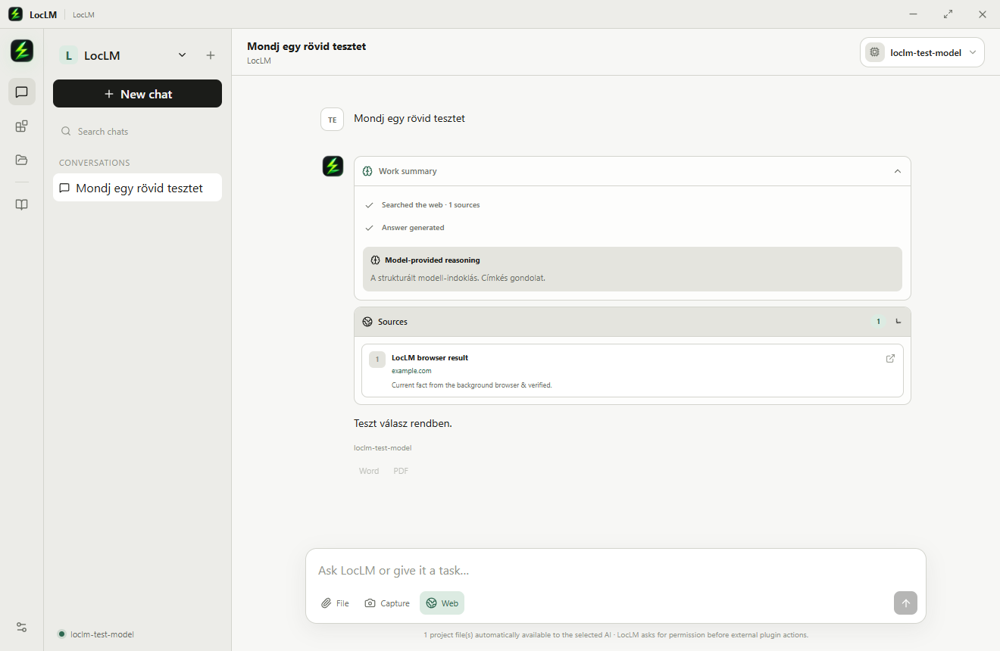
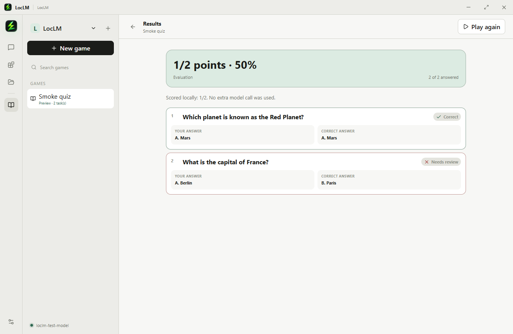
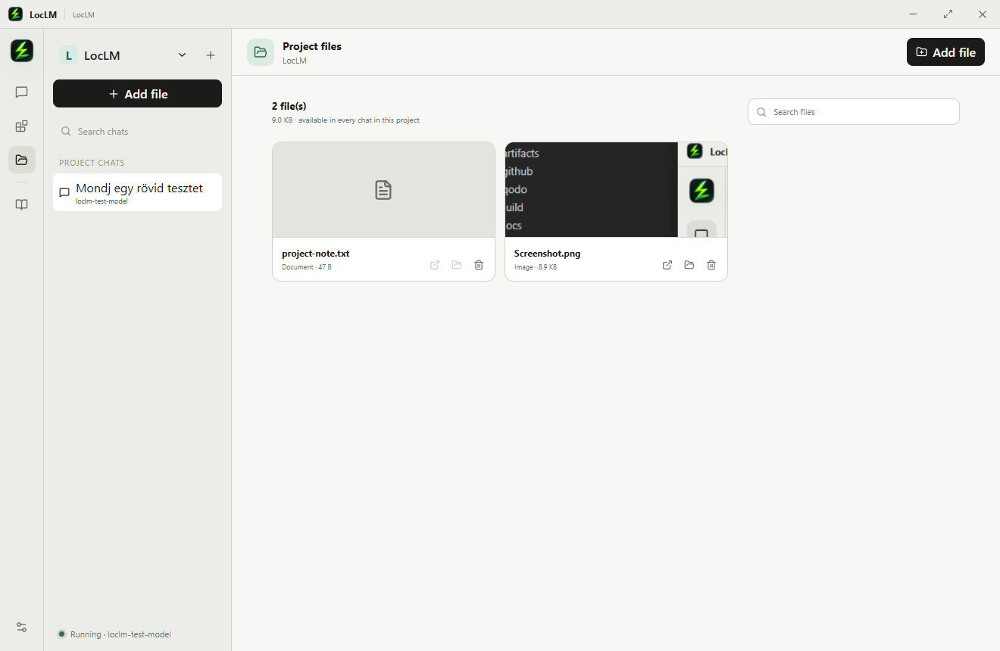
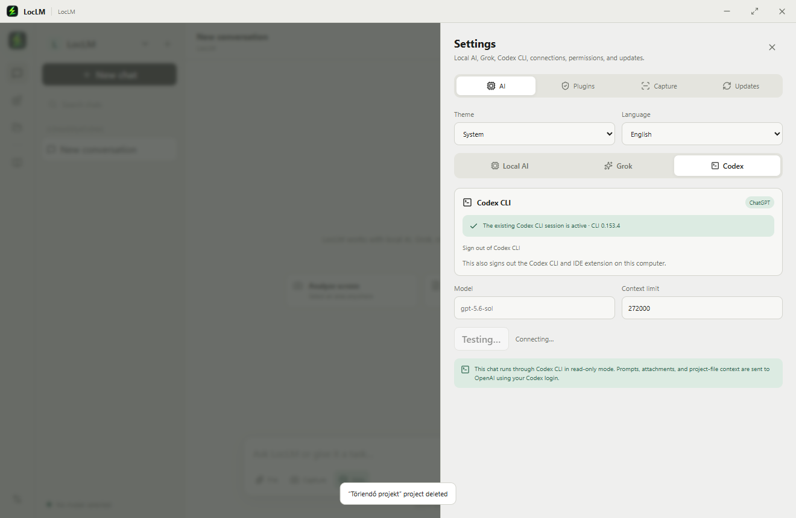
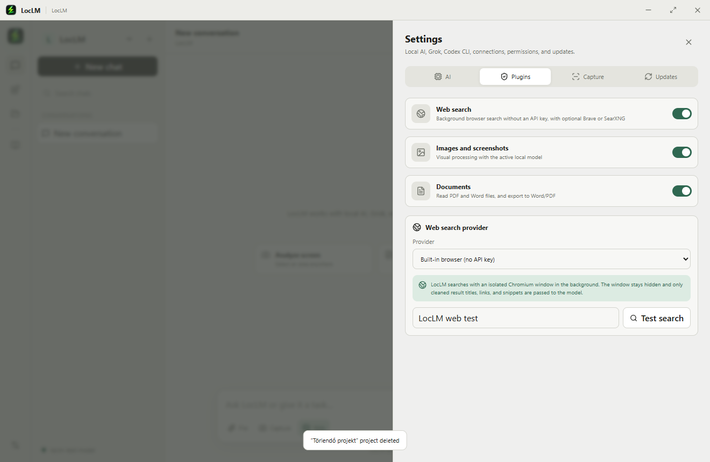

<div align="center">
  
  <h1>LocLM</h1>
  <p><strong>A local-first desktop workspace for AI-powered projects, research, documents, and learning.</strong></p>
  <p>
    Run local OpenAI-compatible models, use your existing Grok or Codex CLI session, and keep every conversation and file organized by project.
  </p>

  [](https://github.com/TheRealMagyar/LocLM/releases/latest)
  [](https://github.com/TheRealMagyar/LocLM/actions/workflows/release.yml)
  [](LICENSE)
  

  [Download for Windows](https://github.com/TheRealMagyar/LocLM/releases/latest) · [Features](#features) · [Setup](#getting-started) · [Development](#development)
</div>

<br />



## What is LocLM?

LocLM is an open-source Electron desktop application that brings local and subscription-backed AI into one focused workspace. Projects combine conversations, reusable files, model settings, web research, screen captures, and learning games without turning the interface into a developer console.

Local models remain the default path. External providers are explicit: Grok uses the existing Grok CLI session, Codex uses the installed Codex CLI and its existing OpenAI login, and web search only runs when enabled for a message.

## Features

| Area | Capabilities |
| --- | --- |
| **AI providers** | LM Studio and other OpenAI-compatible local endpoints, Grok subscriptions, and Codex CLI |
| **Project context** | Project-scoped chats and files; extracted document text and supported images are automatically available to the selected AI |
| **Chat experience** | Streaming responses, cancellation, model switching, Markdown, source cards, and collapsible reasoning/work summaries |
| **Documents** | Read PDF, DOCX, text, Markdown, JSON, CSV, PNG, JPEG, and WebP; export responses to Word or PDF |
| **Research** | Built-in background web search with DuckDuckGo/Bing fallback, plus optional Brave Search and SearXNG |
| **Screen capture** | Global, remappable shortcut with optional automatic analysis and temporary-image handling |
| **Learning games** | AI-generated quizzes, fill-in-the-blank tasks, matching exercises, exam simulations, local scoring, and detailed answer review |
| **Desktop experience** | Light, dark, and system themes; English and Hungarian UI; automatic updates through GitHub Releases |

## Screenshots

| Learning results | Project file context |
| --- | --- |
|  |  |

| Codex CLI provider | Web search configuration |
| --- | --- |
|  |  |

<details>
<summary><strong>Adding or replacing screenshots and GIFs</strong></summary>

Keep repository media in `docs/screenshots/` and use descriptive, lowercase filenames. The automated smoke test can regenerate the current screenshots:

```powershell
$env:LOCLM_SMOKE_SCREENSHOT_DIR = "docs/screenshots"
pnpm test:smoke
```

For an animated walkthrough, add `docs/screenshots/loclm-demo.gif` and replace the main screenshot near the top of this README with:

```markdown

```

For a clean GitHub preview, keep media at a 16:9 or similar desktop aspect ratio and optimize large GIFs before committing them.

</details>

## Download

### Windows

Download the latest installer from [GitHub Releases](https://github.com/TheRealMagyar/LocLM/releases/latest), then run the `LocLM Setup` executable.

The current community builds may be unsigned. If Windows SmartScreen appears, verify that the download came from this repository's Releases page before choosing **More info → Run anyway**.

LocLM does not bundle an AI model. Configure at least one provider after installation:

- A local OpenAI-compatible server such as [LM Studio](https://lmstudio.ai/).
- An authenticated Grok CLI session.
- An installed and authenticated [Codex CLI](https://developers.openai.com/codex/cli).

## Getting started

1. Open **Settings → AI**.
2. Choose **Local AI**, **Grok**, or **Codex**.
3. Test the connection and select a model.
4. Create a project and add any files you want available as reusable context.
5. Start a chat, enable web research when needed, or create a learning game from your source material.

### Local AI

Start an OpenAI-compatible server and enter its base URL in LocLM. For LM Studio, the default is usually:

```text
http://127.0.0.1:1234/v1
```

LocLM lists the available models from the endpoint. Enable vision support for models that can process images and screen captures.

### Grok

LocLM reuses the Grok CLI session stored on the computer. Sign in with `grok login` or use the sign-in action in **Settings → AI → Grok**, then select one of the models exposed by your subscription.

Prompts and attachments sent through Grok are processed by xAI through the authenticated Grok CLI service.

### Codex CLI

Install Codex CLI and run `codex login`, or start the ChatGPT sign-in flow from **Settings → AI → Codex**. LocLM invokes `codex exec --json` in an ephemeral, read-only session and does not read or copy your Codex credentials.

If the executable is not on `PATH`, set `LOCLM_CODEX_PATH` to the full Codex executable path before starting LocLM.

### Web research

The built-in provider performs API-key-free searches in an isolated background Chromium window and sends only cleaned titles, URLs, and snippets to the selected model. Brave Search and self-hosted SearXNG are also supported.

Web access is message-scoped: turn on **Web** in the composer when current information is needed. Search results are preserved as source cards alongside the assistant response.

## Privacy and security

- The renderer has no direct Node.js access; Electron context isolation and sandboxing are enabled.
- The preload bridge exposes a typed, restricted set of IPC operations.
- Local model prompts and attachments stay on the computer unless an explicitly selected external provider or web search is used.
- API keys are stored through Electron's encrypted credential storage when available.
- Codex and Grok authentication is handled by their respective CLI sessions.
- Only HTTP and HTTPS URLs can be opened externally.

## Development

### Requirements

- Node.js 24 or newer
- pnpm 11 or newer
- Windows, macOS, or Linux desktop environment

### Run locally

```bash
git clone https://github.com/TheRealMagyar/LocLM.git
cd LocLM
pnpm install
pnpm dev
```

### Quality checks

```bash
pnpm typecheck
pnpm build
pnpm test:smoke
```

### Package the application

```bash
# Current operating system
pnpm dist

# Windows installer
pnpm build
pnpm exec electron-builder --win --publish never
```

Build output is written to `release/`.

## Release process

GitHub Actions builds release artifacts from version tags. After updating the package version and validating the application:

```bash
git tag -a v0.1.7 -m "LocLM v0.1.7"
git push origin main
git push origin v0.1.7
```

The release workflow publishes the Windows installer and update metadata to GitHub Releases. Production distribution should use code signing through the configured `CSC_LINK` and `CSC_KEY_PASSWORD` repository secrets.

## Project structure

```text
src/main/       Electron main process and desktop services
src/preload/    Typed, isolated IPC bridge
src/renderer/   React user interface
src/shared/     Shared TypeScript types and model utilities
scripts/        Automated smoke and integration tests
docs/           README media and project documentation
build/          Application icons and packaging resources
```

## Contributing

Issues and pull requests are welcome. For UI changes, include before/after screenshots where practical and run the quality checks above before submitting.

## License

LocLM is available under the [MIT License](LICENSE).
